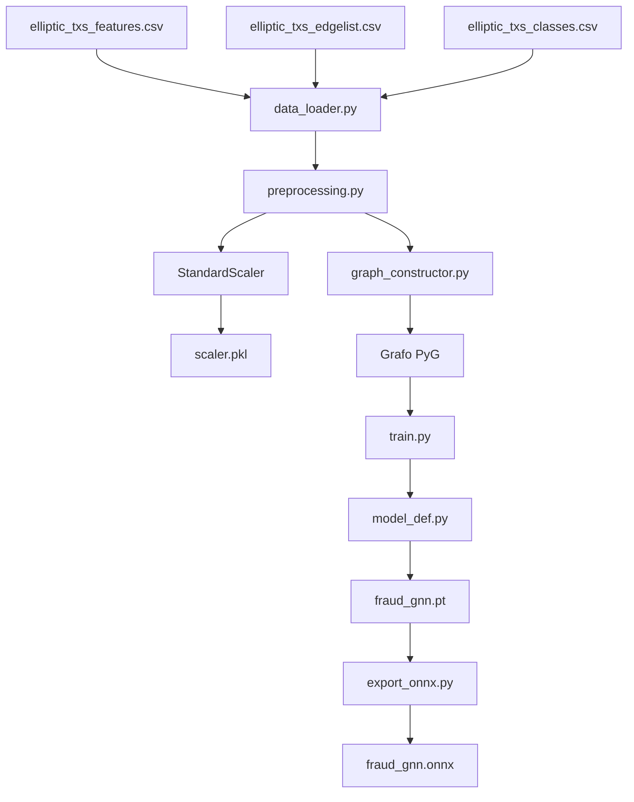

# GraphShield-GNN Demo
# GraphShield-GNN: Detección de Fraude con Redes Neuronales de Grafos

GraphShield-GNN es un proyecto integral que demuestra la implementación de un sistema de detección de fraude en tiempo real utilizando Redes Neuronales de Grafos (GNN). El proyecto abarca desde el entrenamiento del modelo hasta el despliegue de servicios de inferencia comparativos (Python y Java), con un enfoque en la robustez, observabilidad y reproducibilidad.

## Tabla de Contenidos

- [Visión General](#visión-general)
- [Arquitectura del Sistema](#arquitectura-del-sistema)
- [Componentes del Proyecto](#componentes-del-proyecto)
  - [Datos (Dataset Elliptic)](#datos-dataset-elliptic)
  - [Pipeline de Entrenamiento del Modelo GNN](#pipeline-de-entrenamiento-del-modelo-gnn)
  - [Modelo Entrenado (ONNX)](#modelo-entrenado-onnx)
  - [Servicios de Inferencia](#servicios-de-inferencia)
  - [Infraestructura y Observabilidad](#infraestructura-y-observabilidad)
  - [Benchmarking](#benchmarking)
- [Creación y Entrenamiento del Modelo](#creación-y-entrenamiento-del-modelo)
- [Herramientas y Tecnologías](#herramientas-y-tecnologías)
- [Replicación del Proyecto](#replicación-del-proyecto)
- [Estructura de Directorios](#estructura-de-directorios)
- [Análisis de Logs y Troubleshooting](#análisis-de-logs-y-troubleshooting)
- [Resultados de Comparativa](#resultados-de-comparativa)

## Visión General

El proyecto tiene como objetivo principal detectar transacciones fraudulentas analizando no solo las características de las transacciones individuales, sino también sus interconexiones, formando un grafo. Se utiliza un modelo GraphSAGE (un tipo de GNN) entrenado con el dataset Elliptic. El sistema expone este modelo a través de dos microservicios de inferencia, uno implementado en Python (FastAPI) y otro en Java (Quarkus), permitiendo una comparación de rendimiento. Todo el sistema está contenerizado con Docker y orquestado con Docker Compose, e incluye un stack de observabilidad con Prometheus, Grafana y Jaeger.

## Arquitectura del Sistema

El sistema se divide en varias etapas y componentes clave que interactúan entre sí:

- **Fuente de Datos**: El dataset Elliptic, que contiene transacciones de Bitcoin con características y etiquetas de fraude.
- **Pipeline de Entrenamiento**: Un conjunto de scripts Python que procesan los datos, construyen el grafo, entrenan el modelo GraphSAGE y lo exportan al formato ONNX.
- **Modelo ONNX**: El modelo serializado, listo para ser utilizado en diferentes entornos de inferencia.
- **Servicios de Inferencia**:
  - **Servicio Python**: Una API REST construida con FastAPI que carga el modelo ONNX usando ONNX Runtime.
  - **Servicio Java**: Una API REST construida con Quarkus que carga el modelo ONNX usando DJL (Deep Java Library).
  - Ambos servicios exponen un endpoint `/score` para predecir la probabilidad de fraude de una transacción dada.
- **Contenerización**: Docker se utiliza para empaquetar cada servicio y sus dependencias. Docker Compose orquesta el despliegue de todos los contenedores.
- **Observabilidad**:
  - **Prometheus**: Recolecta métricas de los servicios de inferencia.
  - **Grafana**: Visualiza las métricas recolectadas por Prometheus a través de dashboards.
  - **Jaeger**: Permite el tracing distribuido de las peticiones a través de los servicios.
- **Benchmarking**: Un script (wrk) para realizar pruebas de carga sobre los servicios de inferencia y comparar su rendimiento.

### Diagrama General de Arquitectura

```mermaid
graph TD
    subgraph "Fase de Entrenamiento (Local/CI)"
        A1[Dataset Elliptic CSVs] --> B1(data_loader.py);
        B1 --> C1(preprocessing.py - Scaler);
        C1 --> D1(graph_constructor.py);
        D1 --> E1(model_def.py - GraphSAGE);
        E1 --> F1(train.py);
        F1 --> G1[fraud_gnn.pt - Modelo PyTorch];
        C1 --> H1[scaler.pkl];
        G1 --> I1(export_onnx.py);
        I1 --> J1[fraud_gnn.onnx - Modelo ONNX];
    end

    subgraph "Fase de Inferencia y Despliegue (Docker)"
        J1 --> K1[Python Service (FastAPI + ONNX Runtime)];
        J1 --> K2[Java Service (Quarkus + DJL + ONNX Runtime)];
        H1 -.-> K1;
        H1 -.-> K2;

        L[Cliente API / wrk] --> K1;
        L --> K2;

        K1 --> M1[Prometheus];
        K2 --> M1;
        M1 --> N1[Grafana];
        K1 --> O1[Jaeger];
        K2 --> O1;

        P[Docker Compose] -.-> K1;
        P -.-> K2;
        P -.-> M1;
        P -.-> N1;
        P -.-> O1;
    end

    style J1 fill:#f9f,stroke:#333,stroke-width:2px
    style H1 fill:#f9f,stroke:#333,stroke-width:2px
```

## Componentes del Proyecto

### Datos (Dataset Elliptic)

El proyecto utiliza el dataset Elliptic, que contiene transacciones de Bitcoin etiquetadas como lícitas o ilícitas. Este dataset se compone de tres archivos CSV principales:

- **elliptic_txs_features.csv**: Contiene 165 características para cada transacción, incluyendo 2 columnas adicionales para ID y timestamp.
- **elliptic_txs_edgelist.csv**: Define las conexiones entre transacciones, formando el grafo.
- **elliptic_txs_classes.csv**: Contiene las etiquetas para cada transacción (1=ilícita, 2=lícita, unknown=desconocida).

Los datos se gestionan con DVC (Data Version Control) para asegurar reproducibilidad.

### Pipeline de Entrenamiento del Modelo GNN

El pipeline de entrenamiento está implementado como una serie de módulos Python:

- **data_loader.py**: Carga y preprocesa los datos del dataset Elliptic.
- **preprocessing.py**: Escala y normaliza las características, guardando el scaler para uso en inferencia.
- **graph_constructor.py**: Construye el grafo de transacciones para el entrenamiento.
- **model_def.py**: Define la arquitectura del modelo GraphSAGE.
- **train.py**: Entrena el modelo y lo guarda en formato PyTorch (.pt).
- **export_onnx.py**: Exporta el modelo entrenado a formato ONNX para inferencia multiplataforma.

### Modelo Entrenado (ONNX)

El modelo entrenado se exporta al formato ONNX (Open Neural Network Exchange), que permite su uso en diferentes plataformas y lenguajes de programación. El modelo tiene:

- **Entrada**: Características de transacción (165 valores flotantes) y estructura del grafo.
- **Salida**: Probabilidad de que la transacción sea fraudulenta (valor entre 0 y 1).
- **Arquitectura interna**: GraphSAGE con dos capas de convolución y una capa de salida.

### Servicios de Inferencia

#### Servicio Python (FastAPI)

Implementado con:
- **FastAPI**: Framework web de alto rendimiento.
- **ONNX Runtime**: Motor de inferencia para modelos ONNX.
- **Prometheus Instrumentator**: Para generar métricas.
- **OpenTelemetry**: Para trazabilidad distribuida.

Componentes clave:
- **main.py**: Punto de entrada y configuración del API.
- **gnn_service.py**: Servicio de inferencia que carga y utiliza el modelo ONNX.
- **schemas.py**: Definiciones Pydantic para validación de datos.

#### Servicio Java (Quarkus)

Implementado con:
- **Quarkus**: Framework Java para microservicios.
- **DJL (Deep Java Library)**: Librería para ML en Java.
- **MicroProfile Metrics**: Para generación de métricas.
- **SmallRye Health**: Para health checks.

Componentes clave:
- **GnnInferenceService.java**: Servicio de inferencia con el modelo ONNX.
- **ScoringResource.java**: Recurso REST que expone el endpoint `/score`.
- **TxDto.java y ScoreDto.java**: DTOs para entrada y salida.

### Infraestructura y Observabilidad

La infraestructura se gestiona con Docker Compose e incluye:

- **Prometheus**: Recolecta métricas de ambos servicios. Configuración en `/infrastructure/prometheus/`.
- **Grafana**: Visualiza métricas con dashboards preconfigurados. Configuración en `/infrastructure/grafana/`.
- **Jaeger**: Sistema de tracing distribuido. Se conecta a ambos servicios a través de OpenTelemetry.
- **Alertas**: Configuradas en Prometheus para notificar sobre latencia alta, tasas de error elevadas o servicios caídos.

### Benchmarking

El proyecto incluye un sistema de benchmarking para comparar el rendimiento de ambos servicios:

- **run_load_test.sh**: Script que utiliza wrk para realizar pruebas de carga contra ambos servicios.
- **Métricas recopiladas**: Solicitudes por segundo, latencia (promedio, P50, P99), tasas de error.
- **Análisis comparativo**: Genera informes que permiten contrastar rendimiento entre Python y Java.

## Creación y Entrenamiento del Modelo

### Diagrama del Pipeline de Entrenamiento



### Pasos Detallados

1. **Preparación de datos**:
   - Carga de CSVs con `data_loader.py`
   - Normalización con `preprocessing.py`, que usa StandardScaler y guarda el estado en `scaler.pkl`
   - Construcción del grafo con `graph_constructor.py`, creando un objeto Data de PyTorch Geometric

2. **Entrenamiento**:
   - La clase `FraudGraphSAGE` define el modelo con 2 capas SAGEConv y una capa final
   - Entrenamiento con optimizador Adam, minimizando binary cross entropy
   - Los parámetros entrenados se guardan en `fraud_gnn.pt`

3. **Exportación**:
   - El modelo PyTorch se exporta a ONNX con soporte para grafos dinámicos
   - Se incluyen los nombres de entradas/salidas y se manejan ejes dinámicos

## Herramientas y Tecnologías Utilizadas

| Categoría | Tecnologías |
|----------|-------------|
| Entrenamiento | PyTorch, PyTorch Geometric, scikit-learn, pandas, numpy, ONNX |
| Servicio Python | FastAPI, uvicorn, ONNX Runtime, Pydantic, Prometheus Instrumentator, OpenTelemetry |
| Servicio Java | Quarkus, DJL (Deep Java Library), ONNX Runtime for Java, MicroProfile, RESTEasy Reactive |
| Contenerización | Docker, Docker Compose |
| Observabilidad | Prometheus, Grafana, Jaeger |
| Benchmarking | wrk, shell scripting |
| Gestión de datos | DVC (Data Version Control) |
| CI/CD | Makefile |

## Replicación del Proyecto

### Prerrequisitos Generales

- Git
- Docker y Docker Compose
- Conda (para el entorno de entrenamiento)
- wrk (para benchmarking)
- jq (para procesamiento de JSON)

### Pasos de Configuración e Instalación

1. Clonar el repositorio:
   ```bash
   git clone https://github.com/tu-usuario/graphshield-gnn-demo.git
   cd graphshield-gnn-demo
   ```

2. Configurar el entorno y descargar datos:
   ```bash
   make setup
   ```
   Esto creará un entorno conda `gnn` y descargará los datos mediante DVC.

3. Entrenar el modelo (opcional, ya se incluye un modelo pre-entrenado):
   ```bash
   make train
   ```

4. Construir las imágenes Docker:
   ```bash
   make build
   ```

5. Levantar los servicios:
   ```bash
   make up
   ```

6. Verificar que los servicios estén funcionando:
   ```bash
   curl http://localhost:9443/health
   curl http://localhost:9444/health
   ```

7. Acceder a los dashboards:
   - Grafana: http://localhost:3000 (usuario: admin, contraseña: graphshield)
   - Prometheus: http://localhost:9090
   - Jaeger: http://localhost:16686

8. Ejecutar benchmarks:
   ```bash
   make bench
   # O con parámetros personalizados:
   ./benchmark/run_load_test.sh 30s 50 4
   ```

### Ejecución de Comandos Comunes (Makefile)

El proyecto incluye un Makefile que facilita las operaciones comunes:

- `make setup`: Configura el entorno y descarga datos
- `make train`: Entrena el modelo GNN y lo exporta a ONNX
- `make build`: Construye las imágenes Docker
- `make up`: Levanta todos los servicios
- `make down`: Detiene todos los servicios
- `make restart`: Reinicia todos los servicios
- `make logs`: Muestra logs de los servicios
- `make bench`: Ejecuta benchmarks de comparación

### Notas Específicas por Sistema Operativo

#### Linux
- La instalación es directa usando los comandos anteriores.
- Para instalar wrk: `sudo apt-get install -y wrk` (Ubuntu/Debian)

#### macOS
- Recomendado usar Docker Desktop para Mac.
- Para instalar wrk: `brew install wrk`
- Para mejorar rendimiento, aumentar recursos de Docker (CPU/memoria)

#### Windows
- Usar WSL2 (Windows Subsystem for Linux) para mejor compatibilidad.
- Alternativa: Docker Desktop con contenedores Linux.
- O usar PowerShell con Docker y Git instalados.

## Estructura de Directorios

```
graphshield-gnn-demo/
├── benchmark/               # Scripts de benchmark
│   ├── results/             # Resultados de pruebas de carga
│   └── run_load_test.sh     # Script principal de benchmarking
├── data/                    # Datos versionados con DVC
│   └── elliptic_dataset/    # Dataset Elliptic
├── infrastructure/          # Configuración de infraestructura
│   ├── docker-compose.yml   # Orquestación de servicios
│   ├── grafana/             # Configuración y dashboards de Grafana
│   ├── prometheus/          # Configuración y alertas de Prometheus
├── java-service/            # Servicio de inferencia Java (Quarkus)
│   ├── src/                 # Código fuente Java
│   ├── Dockerfile.jvm       # Dockerfile para versión JVM
│   └── pom.xml              # Configuración Maven
├── model/                   # Modelos entrenados
│   ├── fraud_gnn.onnx       # Modelo exportado en formato ONNX
│   ├── fraud_gnn.pt         # Modelo PyTorch (checkpoint)
│   └── scaler.pkl           # Scaler serializado para normalización
├── python-service/          # Servicio de inferencia Python (FastAPI)
│   ├── *.py                 # Módulos Python del servicio
│   └── Dockerfile           # Dockerfile para el servicio
├── training/                # Pipeline de entrenamiento
│   ├── src/                 # Código fuente del entrenamiento
│   ├── environment.yml      # Definición del entorno conda
│   └── run_training_pipeline.sh  # Script de entrenamiento
├── .gitattributes           # Configuración para Git LFS
├── .gitignore               # Archivos ignorados por Git
├── Makefile                 # Comandos para gestión del proyecto
└── README.md                # Este archivo
```

## Análisis de Logs y Troubleshooting

### Logs Comunes y su Interpretación

#### Errores en el Servicio Python
- Error 404 en `/metrics`: Indica un problema con la configuración del instrumentador de Prometheus.
- Error 500 en `/score`: Puede indicar un problema con el formato de los datos de entrada o con la carga del modelo ONNX.

#### Errores en el Servicio Java
- Connection refused en Jaeger: Indica problemas de conectividad con el servicio Jaeger.
- Error SEVERE en VertxGrpcExporter: Problemas con la exportación de trazas a OpenTelemetry.

### Solución de Problemas Comunes

1. Servicios en estado "unhealthy":
   ```bash
   # Verificar logs del servicio
   docker-compose -f infrastructure/docker-compose.yml logs python-service
   docker-compose -f infrastructure/docker-compose.yml logs java-service
   ```

2. Errores en peticiones al endpoint `/score`:
   - Verificar formato del JSON enviado (debe tener 165 características)
   - Comprobar que el modelo ONNX está correctamente cargado

3. Métricas no aparecen en Grafana:
   - Verificar que Prometheus puede acceder a los endpoints de métricas
   - Revisar configuración de los dashboards de Grafana

## Resultados de Comparativa

Las pruebas de benchmark muestran diferencias significativas entre las implementaciones:

| Métrica | Java (Quarkus) | Python (FastAPI) | Diferencia |
|--------|----------------|------------------|------------|
| Peticiones/seg | ~5,484 | ~626 | 8.8x más rápido |
| Latencia mediana | 4.45ms | 74.16ms | 16.7x menor |
| Latencia P99 | 10.77ms | 173.80ms | Python mejor en P99 |

Este análisis demuestra que:

- Java ofrece mayor throughput: Aproximadamente 8.8 veces más solicitudes por segundo.
- Java tiene menor latencia típica: La respuesta es aproximadamente 16.7 veces más rápida.
- Python puede ser más estable en casos extremos: Mejor latencia en percentil 99.

La elección entre implementaciones depende de las prioridades del proyecto:

- Para máximo rendimiento y escalabilidad: Java con Quarkus
- Para desarrollo rápido y prototipado: Python con FastAPI

Este proyecto demuestra el poder de ONNX para la interoperabilidad de modelos ML, permitiendo entrenar un modelo una vez y desplegarlo en múltiples plataformas con diferentes características de rendimiento.